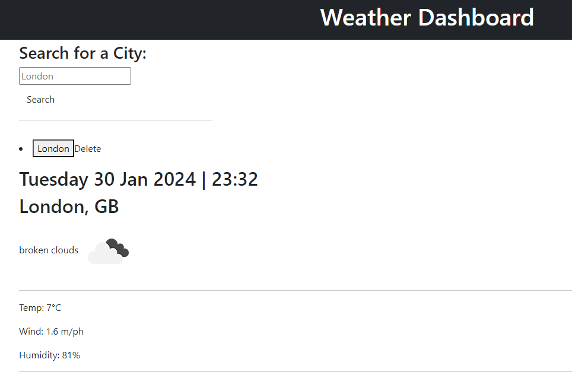

# weather-dashboard-dominic
weather app to display 5 day forecast for selected cities
This task was to create a 5 day weather forcaster using API's and local storage. 

The challenge of this task was utilising the API with .fetch commands and this was definately challenging. 

I am aware that the weather dashboard is incomplete as it is at the moment, this is because I am still working on the logic to correctly display the 5 day forcast. I am continuously looking at the code to try and develope it into a finished product. 

Please see some snippets of the current application.

https://github.com/dpaul93/weather-dashboard-dominic

https://dpaul93.github.io/weather-dashboard-dominic/